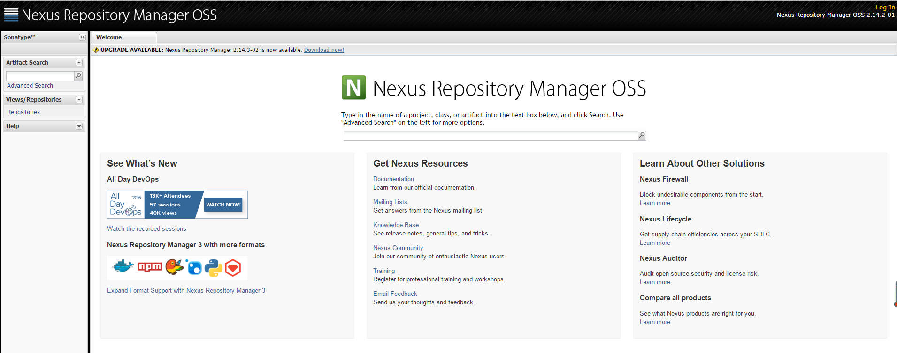
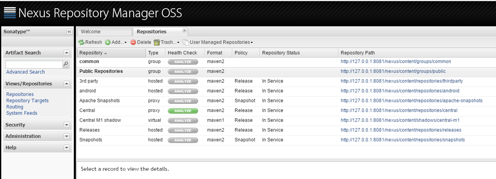
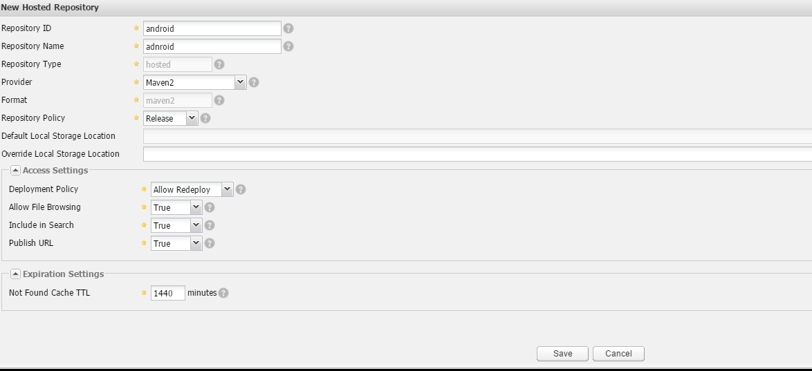
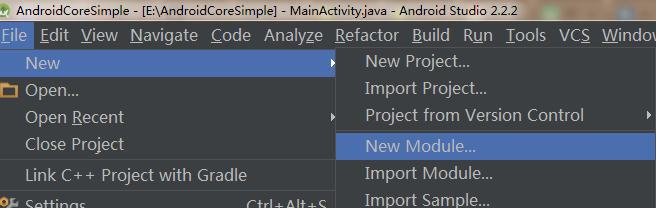
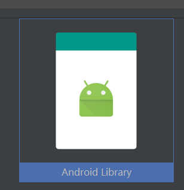
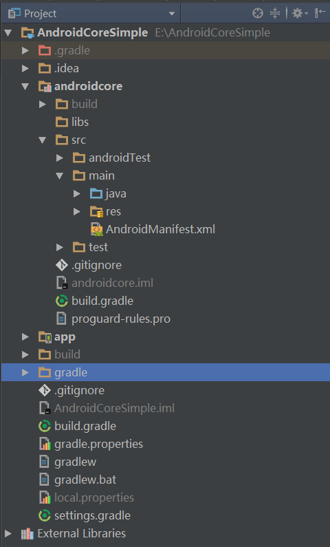
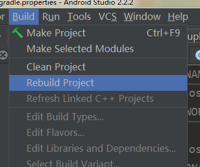
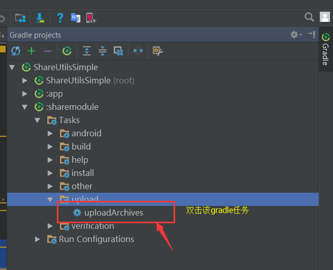

## 目的：
本教程为**Android**发布**library**到本地 **maven**服务器的过程
## 使用场景
在公司内部有多个项目同时开发，但是有些功能在每个项目里面都有的，例如网络加载、图片加载等等，这些基础库一旦改变则每个项目都要改。所以可以通过单独创建一个项目，把这些通用的功能集中起来，发布到本地仓库，最后在实际项目中通过**gradle**依赖的形式即可完成功能的添加。这样更加方便修改和管理。
## 步骤：
### 搭建一个本地**maven**仓库
1. 这里我们使用Nexus 来做本地仓库的搭建
	* 到官网下载安装包[https://www.sonatype.com/download-oss-sonatype](https://www.sonatype.com/download-oss-sonatype)
	* 如果不能翻墙 [百度云盘](http://pan.baidu.com/s/1hsQdID2)
2. 解压下载下来的包
	* 定位到  ..\nexus-2.14.2-01-bundle\nexus-2.14.2-01\bin\jsw\windows-x86-64 下 (如果是32位请到另外一个文件夹windows-x86-32)
	* 直接双击**console-nexus.bat** 过一会
	* 打开浏览器 进入改地址 [http://127.0.0.1:8081/nexus/#welcome](http://127.0.0.1:8081/nexus/#welcome)
	**如果能显示该界面表示你已经搭建成功**
3. 在右上角点击**Log in** 输入默认的账号密码
	> username: admin
	> 
	> password: admin123
4. 点击左边导航栏**Repositories**到仓库界面，点击**add**操作生成一个**type**为**hosted**的文件夹
	
	
	该文件夹为**android**,对应后面android项目内添加依赖时要用到
### 制作**library**并发布 到**maven**库

1. 打开**Android studio**创建一个**Android**项目，作为测试**library**的项目
2. 再创建一个module，形式为**Android Library**
	
	
	
	
	
	项目结构为：
	
3. 在**module**下的**build.gradle**文件中加入以下代码

		....
		apply plugin: 'maven'
	
		uploadArchives {
			configuration = configurations.archives
			repositories {
			    mavenDeployer {
			        snapshotRepository(url: MAVEN_REPO_SNAPSHOT_URL) {
			            authentication(userName: NEXUS_USERNAME, password: NEXUS_PASSWORD)
			        }
			        repository(url: MAVEN_REPO_RELEASE_URL) {
			            authentication(userName: NEXUS_USERNAME, password: NEXUS_PASSWORD)
			        }
			        pom.project {
			            version VERSION
			            artifactId MUDULE_NAME
			            groupId GROUP_ID
			            packaging TYPE
			            description DESCRIPTION
			        }
			    }
			}
	    }
			
		artifacts {
			archives file('coremodule.aar')
		}
	> **注意**：coremodule.aar 请在build好项目后在

	>your module >build>outputs>aar  找到该文件名，该文件即为上传到maven仓库的aar文件
4. 在项目根目录下**gradle.properties**文件中加入下列代码 用于做**maven**仓库的配置
	
	    # 配置本地maven库参数
		# 该路径每个module都通用，Android项目都上传到该路径下
		MAVEN_REPO_RELEASE_URL=http://127.0.0.1:8081/nexus/content/repositories/android/
		# 上传快照路径，便于maven做管理用
		MAVEN_REPO_SNAPSHOT_URL=http://127.0.0.1:8081/nexus/content/repositories/snapshots/
		#对应maven的GroupId的值 可以不填
		GROUP = android
	
		#登录nexus ossde的用户名
		NEXUS_USERNAME=admin
		#登录nexus oss的密码
		NEXUS_PASSWORD=admin123
			
		# groupid 上传maven会在对应的仓库目录下创建一个以改值命名的文件夹，最好是module名
		GROUP_ID = common
			
		# type
		TYPE = aar
	
		# description 对该module的描述
		DESCRIPTION = android 基础库
	
		# module的版本号 不用写分号
		VERSION = 1.0.0
	
		# 依赖包的包名
		MUDULE_NAME core-module-lib
	
	
5. 编写好**module**的代码后，**Rebuild Project**
	
		
6. 执行上传操作，发布**library**
	
	
7. 发布成功

### 如何在项目中使用已发布的库
1. 在项目根目录的**build.gradle**文件中加入下面的代码
	
		allprojects {
		   repositories {
		       ....
		       maven{ url 'http://127.0.0.1:8081/nexus/content/repositories/android/'}
		   }
		}
2. 在**app**目录下的**build.gradle**中加入下面的配置
	

		compile 'common:core-module-lib:1.0.0' 